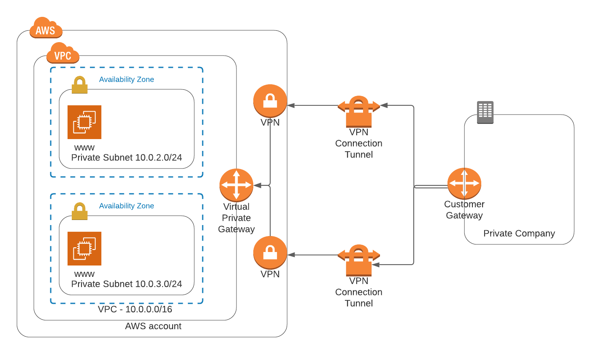

# Private Corporate Cloud Network
The following document contains instructions on how to deploy an on-premise network using AWS CloudFormation.

## Network Diagram

In comparison to a public network, an on-premise network contains only private subnets, and does not have NAT Gateways. These components get replaced by a VGW (Virtual Gateway) and a VPN Connection. A CGW (Customer Gateway) represents the on-premises side of the VPN Connection.

## Network Deployment

### Create network

To create the network stack run the following command:

`./create.sh network network.yaml network-parameters.json`                                    

### Update infrastructure

To update the already existing network stack run the following command:

`./update.sh network network.yaml network-parameters.json`     